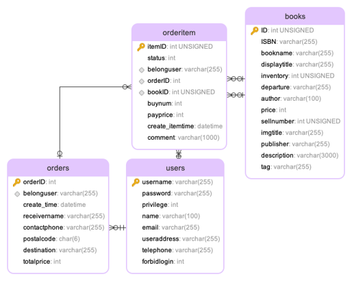
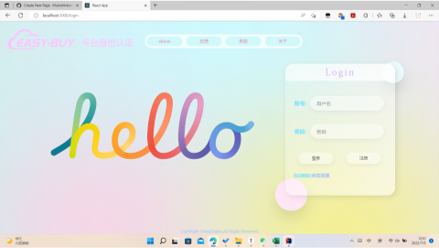
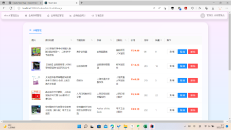

# eBook eBookstore README

This Web APP is a big assignment for my Principles of Databases course. Here, I worked with my fellow team members to implement an online eBook shop.

## Project Technology Stack

The technology stack of the project includes:

+ Front-end architecture: React framework + Ant Design component library

+ back-end framework: Spring 2.7.5

+ Front-end and back-end communication: Fetch API to achieve JSON data delivery

+ Database access using Java JDBC, this system all use to the database are:

-Redis: store frequently read K-V type data

-MySQL: stores relational data

-MongoDB: store user avatar and some unstructured data.

## Project Features

The project basically implements the following basic bookstore functions: user management, user login and registration, book management, book browsing, book purchasing, shopping cart management, administrator statistics, and other basic bookstore functions. In addition, we have also implemented advanced features such as login security, database transaction control, message middleware, WebSocket, independent caching, graph database support, and so on.

For more details, please refer to the `Report.pptx` file in this catalogue, which describes the basic architecture of the project and the technical details of the implementation.

## Project Database Design

The MySQL database is designed with four tables:

+ Book table: Book

+ User table: User

+ Orders table: Order

+ OrderItem table.

The database ER diagram is as follows:



## Key page display

### User login screen



### Main page


### Shopping Cart



### Sales statistics screen


## Remarks

Since this is only a course project, it has only been tested and verified locally and not deployed on the website. If you need to actually download and deploy, you need to first download mongoDB, nodejs, and any deployment server (such as tomcat or nginx, etc.) for installation and debugging preparations, and then in the project path to use the

```
npm run build
```

in the project path to perform basic operations such as packaging the project. (The specific packages used can be found in the "package.json" file).


# eBook电子书店README

这个Web APP是我数据库原理课程的大作业。在这里，我和我同组组员共同实现了一个网上电子书店。

## 项目技术栈

该项目的技术栈包括：

+ 前端架构：React框架+Ant Design组件库

+ 后端框架：Spring 2.7.5

+ 前后端通讯：Fetch API实现JSON数据传递

+ 数据库访问使用Java JDBC，本系统所有使用到的数据库有：

​	–Redis：存储经常读的K-V式的数据

​	–MySQL：存储关系型数据

​	-MongoDB：存储用户头像和一些非结构化数据

## 项目功能

项目基本实现了：用户管理、用户登录注册、书籍管理、书籍浏览、书籍购买、购物车管理、管理员统计等基本书店功能。此外，我们还同时实现了登录安全、数据库事务控制、消息中间件、WebSocket、独立缓存、图数据库支持等高级功能。

详情可见本目录下的：`Report.pptx`文件，该PPT是详细地叙述了本项目地基本架构与具体实现的技术细节。

## 项目数据库设计

MySQL的数据库设计了四张表：

+ 书籍表：Book

+ 用户表：User

+ 订单表：Order

+ 订单项目表：OrderItem

数据库ER图如下：


## 关键页面展示

### 用户登录界面


### 网页主界面


### 购物车界面


### 销售额统计界面


## 备注

由于仅仅只是课程项目，因此仅在本地进行过测试与验证并未在网站上部署。如果需要实际下载部署使用，需要首先下载mongoDB 、nodejs、以及任意部署服务器等（如tomcat或nginx等）进行安装调试准备，随后在项目路径下使用

```
npm run build
```

进行项目打包等基本操作。（具体使用包可见"package.json"文件）。


